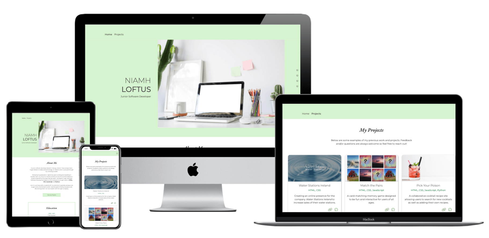
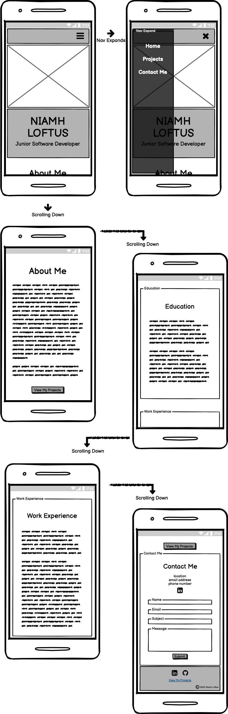
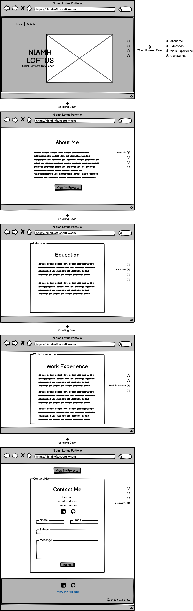
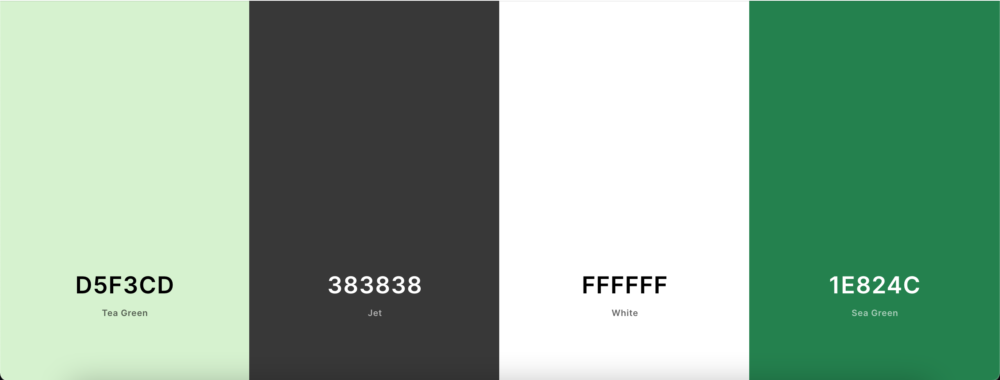

# 
**Niamh Loftus Portfolio Site**

### View the live project [here.](http://www.niamhloftus.com/)

My own personal website built to showcase projects I have created.

---
## Contents
- [**User Experience (UX)**](#ux)
    - [Strategy](#strategy)
    - [Scope](#scope)
    - [Structure](#structure)
    - [Skeleton](#skeleton)
    - [Surface](#surface)
 - [**Technologies Used**](#technologies-used)
    - [Languages](#languages)
    - [Technologies](#technologies)
 - [**Credits**](#credits)

---
## 
**UX**

### **Strategy**
The purpose of this site is to showcase my own  websites and projects with further information about me and my education and work background.

Easy navigation and responsivity accross devices is important. The site's purpose should also be clear. I want there to be simple means for people viewing the site to contact me. Chosen projects should be well-laid out and easy to access.

### **Scope**
- The site must be fully responsive across browsers and devices.
- The site must have navigation ease and be visually consistent throughout.
- The purpose of the site should be immediately evident.
- Simple and clear means of contacting me must be provided via a *contact form* and links to my **LinkedIn** and **GitHub** accounts.
- Each project should be clearly displayed with its name, description and links to both the *live site* and the **GitHub** repo.

### **Structure**
The structure of the site is divided across two main pages.

#### *Home Page*
- The landing page of the site is a scrolling single-page with navigation that allows the user to skip down or up the page to the corresponding sections.
- Contains three different information sections; About Me, Education and Work Experience.
- Contains a contact section with a contact form, contact details and links to social media accounts **GitHub** and **LinkedIn**.

#### *Projects Page*
- Contains all projects/websites each displayed in their own separate container.
    - Each container will display an image of the site, title, description and links to both the *live site* and the **GitHub** repo.

#### *Navigation Bar*
- Contains two links on larger devices; *Home* and *Projects*.
- Contains three links on smaller devices; *Home*, *Projects* and *Contact Me*.
    - *Contact Me* directs the user to that section on the *Home* page.
- Is a collapsed menu on smaller devices for a cleaner design.

#### *Footer*
- Will contain links to social media platforms.
    - **LinkedIn**
    - **GitHub**
- On the *Home* page there is a link to the *Projects* page.
- On the *Projects* page there is a link to the contact section of the *Home* page.

### **Skeleton**
All wireframes were created using [Balsamiq](https://balsamiq.com/).

#### Mobile: *Home* Page

#### Desktop: *Home* Page

Additional PNG wireframes can be found below;
- [Wireframes](documentation/wireframes)

Additional PDF wireframes can be found below;
- [Mobile Wireframes](documentation/wireframes/mobile)
- [Desktop Wireframes](documentation/wireframes/desktop)

### **Surface**
#### **Design**
The site needs to be consistent, appealing and uncluttered. Sections will be clearly laid out and separated, leaving sufficient whitespace to avoid visual overload.

#### **Fonts** 
The Montserrat and EB Garamond fonts will be used for the site as they have a nice contrast. Montserrat has that clean and modern look, whereas EB Garamond is more classic and is also used on my CV. I like the idea of having similar design elements between both CV and website.

#### **Colour**
The colour scheme is simple: a white background with a soft, calming green helping to highlight and separate sections. The addition of the darker green used for some icons and paragraph elements is the same shade I use in my personal CV, helping to tie the two together.

I used [Coolors](https://coolors.co/) to help in choosing the colour scheme. I also used the site's *Contrast Checker* tool to ensure my colours contrasted well together so that all content could be seen and read without strain or difficulty.

- D5F3CD Tea Green 
- 383838 Jet
- FFFFFF White
- 1E824C Sea Green

---
## 
**Technologies Used**

### **Languages**
- HTML
- CSS
- JavaScript

### **Technologies**
- [Balsamiq](https://balsamiq.com/) - used to create wireframes.
- [Bootstrap](https://getbootstrap.com/) - used throughout the site for responsive layouts and styling.
- [Canva](https://www.canva.com/) - used to source main image.
- [Coolors](https://coolors.co/) - used for choosing colour scheme and for contrast-checking of chosen colours.
- [Font Awesome](https://fontawesome.com/) - used for all icons on the site.
- [Git](https://git-scm.com/) - version control software used to commit and push code to GitHub.
- [GitHub](https://github.com/) - hosting site used to store the source code of the site.
- [GitPod](https://www.gitpod.io/) - IDE used to develop the site.
- [Google Chrome DevTools](https://developers.google.com/web/tools/chrome-devtools) - used for inspecting various page elements and identifying any layout issues/bugs.
- [Google Fonts](https://fonts.google.com/specimen/Montserrat) - used to import Montserrat and EB Garamond fonts.
- [Techsini](http://techsini.com/multi-mockup/index.php) -  used to create the multi-device image found at the top of this file.
- [TingPNG](https://tinypng.com/) - used to resize images for web.

---
## 
**Credits**

### **Media**
- Image on *Home* page by *wattanaracha* on [Canva](https://www.canva.com/media/MAEIAQLiWTQ).
- Thumbnail image for Pick Your Poison on *Projects* page by *Getty Images* on [Canva](https://www.canva.com/photos/MADarVk7hps-blackberry-cocktail/).

### **Content**
- All written content on the site including each Project is my own.